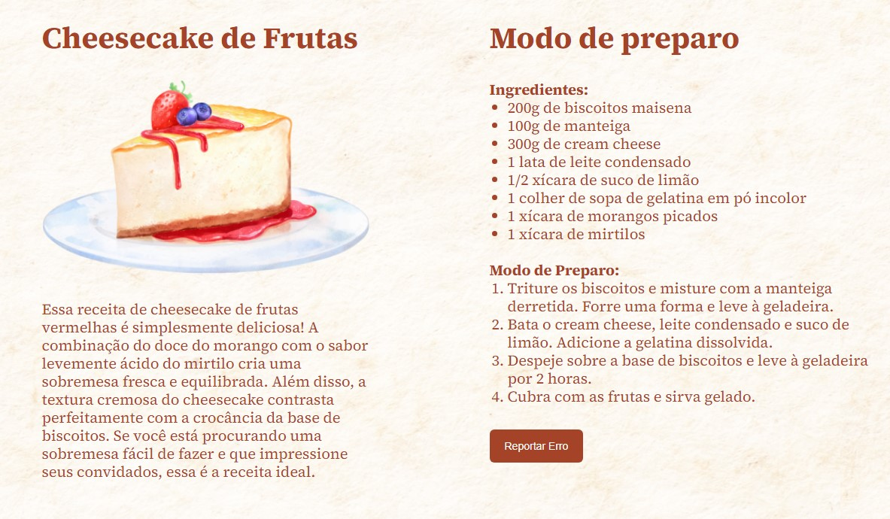
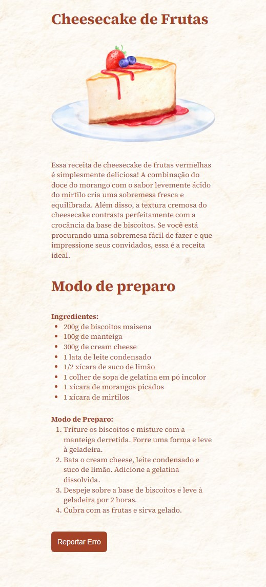

<h1 align="center"> Landingpage Responsiva </h1>

 

## 💻 Projeto

Esse projeto foi criado afim de masterizar os conhecimentos sobre HTML e CSS.
 
Mais especificamente sobre a responsividade e sobre o conceito de mobile first.
 

 

## 🚀 Tecnologias

Esse projeto foi desenvolvido com as seguintes tecnologias:

- HTML e CSS

 

  

  

